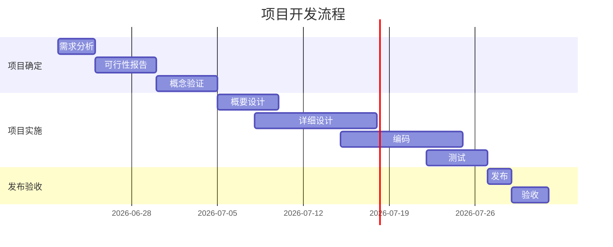

## 一、文本格式化

### 1、加粗

<table>
    <thead>
        <caption>文本<strong>加粗</strong>语法</caption>
        <tr>
            <th>语法</th>
            <th>对应的 HTML 语法</th>
            <th>效果</th>
        </tr>
    </thead>
    <tbody>
        <tr>
            <td><code>**粗体**</code></td>
            <td rowspan="2"><code>&lt;strong&gt;粗体&lt;/strong&gt;</code></td>
            <td rowspan="2"><strong>粗体</strong></td>
        </tr>
        <tr>
            <td><code>__粗体__</code></td>
        </tr>
    </tbody>
    <tfoot>
        <tr>
            <td colspan="3">💡最佳实践：尽可能使用<code>**粗体**</code>。</td>
        </tr>
    </tfoot>
</table>

### 2、斜体

<table>
    <thead>
        <caption>文本<em>斜体</em>语法</caption>
        <tr>
            <th>语法</th>
            <th>对应的 HTML 语法</th>
            <th>效果</th>
        <tr>
    </thead>
    <tbody>
        <tr>
            <td><code>*斜体*</code></td>
            <td rowspan="2"><code>&lt;em&gt;斜体&lt;/em&gt;</code></td>
            <td rowspan="2"><em>斜体</em></td>
        </tr>
        <tr>
            <td><code>_斜体_</code></td>
        </tr>
    </tbody>
    <tfoot>
        <tr>
            <td colspan="3">💡最佳实践：尽可能使用<code>*斜体*</code>。</td>
        </tr>
    </tfoot>
</table>

### 3、删除线

<table>
    <thead>
        <caption>文本<del>删除线</del>语法</caption>
        <tr>
            <th>语法</th>
            <th>对应的 HTML 语法</th>
            <th>效果</th>
        </tr>
    </thead>
    <tbody>
        <tr>
            <td><code>~~删除线~~</code></td>
            <td><code>&lt;del&gt;删除线&lt;/del&gt;</code></td>
            <td><del>删除线</del></td>
        </tr>
    </tbody>
</table>

### 4、下划线（HTML）

<table>
    <thead>
        <caption>文本<u>下划线（HTML）</u>语法</caption>
        <tr>
            <th>语法</th>
            <th>对应的 HTML 语法</th>
            <th>效果</th>
        </tr>
    </thead>
    <tbody>
        <tr>
            <td>无</td>
            <td><code>&lt;u&gt;下划线（HTML）&lt;/u&gt;</code></td>
            <td><u>下划线（HTML）</u></td>
        </tr>
    </tbody>
</table>

### 5、高亮

<table>
    <thead>
        <caption>文本<mark>高亮</mark>语法</caption>
        <tr>
            <th>语法</th>
            <th>对应的 HTML 语法</th>
            <th>效果</th>
        </tr>
    </thead>
    <tbody>
        <tr>
            <td><code>==高亮==</code></td>
            <td><code>&lt;mark&gt;高亮&lt;/mark&gt;</code></td>
            <td><mark>高亮</mark></td>
        </tr>
    </tbody>
</table>

### 6、字体、字号和颜色（样式化）（HTML）

⚠️ 注意：Markdown 本身不支持样式化，以下内容需要使用 HTML 标签。

<table>
    <thead>
        <caption>文本<font face="楷体">字体</font>、<font size="6">字号</font>和<font color="green">颜色</font>（样式化）（HTML）语法</caption>
        <tr>
            <th>样式</th>
            <th>语法</th>
            <th>对应的 HTML 语法</th>
            <th>效果</th>
        </tr>
    </thead>
    <tbody>
        <tr>
            <td><font face="楷体">字体</font></td>
            <td>无</td>
            <td><code>&lt;font face="楷体"&gt;字体&lt;/font&gt;</code></td>
            <td rowspan="3">⬅️见第一列</td>
        </tr>
        <tr>
            <td><font size="6">字号</font></td>
            <td>无</td>
            <td><code>&lt;font size="6"&gt;字号&lt;/font&gt;</code></td>
        </tr>
        <tr>
            <td><font color="green">颜色</font></td>
            <td>无</td>
            <td><code>&lt;font color="green"&gt;颜色&lt;/font&gt;</code></td>
        </tr>
    </tbody>
</table>

💡 **最佳实践**：尽量避免在 Markdown 中使用 HTML 样式，这会使文档难以维护。如果需要样式化，建议使用 CSS 或选择支持样式化的 Markdown 解析器。

## 二、链接

**语法**：

```markdown
全球最大的开发者社区：[GitHub](https://github.com)。
```

**对应的 HTML 语法**：

```html
全球最大的开发者社区：<a href="https://github.com">GitHub</a>。
```

**效果**：

全球最大的开发者社区：[GitHub](https://github.com)。

### 1、链接的 title

鼠标悬停在链接上时的提示文本。

**语法**：

```markdown
[GNU](https://www.gnu.org "伟大，无需多言。")。
```

**对应的 HTML 语法**：

```html
<a href="https://www.gnu.org" title="伟大，无需多言。">GNU</a>。
```

**效果**：

[GNU](https://www.gnu.org "伟大，无需多言。")。

### 2、字面 url

字面 url，不同于超链接，将文本指向一个 url，而是将 url 原样写出来。

**语法**：

```markdown
<https://www.markdownguide.org/>。
```

**对应的 HTML 语法**：

```html
<a href="https://www.markdownguide.org/">https://www.markdownguide.org/</a>。
```

**效果**：

<https://www.markdownguide.org/>。

### 3、邮箱链接

**语法**：

```markdown
<gnu@gnu.org>。
```

**对应的 HTML 语法**：

```html
<a href="mailto:gnu@gnu.org">gnu@gnu.org</a>。
```

**效果**：

<gnu@gnu.org>。

## 三、图像

**语法**：

```markdown

```

**对应的 HTML 语法**：

```html

```

**效果**：


### 1、图像 title

同链接。

### 2、图像链接

**语法**：

```markdown
[](https://www.gnu.org/)
```

**对应的 HTML 语法**：

```html
<a href="https://www.gnu.org/"
  ></a>
```

**效果**：

[](https://www.gnu.org/)

## 四、引用块

**语法**：

```markdown
> GNU's Not Unix!
```

**对应的 HTML 语法**：

```html
<blockquote>GNU's Not Unix!</blockquote>
```

**效果**：

> GNU's Not Unix!

## 五、列表

### 1、有序列表

**语法**：

```markdown
编写程序的 7 个步骤：

1. 定义程序的目标；
2. 设计程序；
3. 编写代码；
4. 编译；
5. 运行程序
6. 测试和调试
7. 维护和修改
```

**对应的 HTML 语法**：

```html
<p>编写程序的 7 个步骤：</p>
<ol>
  <li>定义程序的目标；</li>
  <li>设计程序；</li>
  <li>编写代码；</li>
  <li>编译；</li>
  <li>运行程序</li>
  <li>测试和调试</li>
  <li>维护和修改</li>
</ol>
```

**效果**：

编写程序的 7 个步骤：

1. 定义程序的目标；
2. 设计程序；
3. 编写代码；
4. 编译；
5. 运行程序
6. 测试和调试
7. 维护和修改

### 2、无序列表

**语法**：

```markdown
- React
- Vue
- Astro
```

**对应的 HTML 语法**：

```html
<ul>
  <li>React</li>
  <li>Vue</li>
  <li>Astro</li>
</ul>
```

**效果**：

- React
- Vue
- Astro

## 六、分割线

**语法**：

```markdown
---
```

**对应的 HTML 语法**：

```html
<hr />
```

**效果**：

---

## 七、代码

### 1、行内代码

**语法**：

```markdown
在 C 语言中打印“Hello world!”：`printf("Hello world!\n");`。
```

**对应的 HTML 语法**：

```html
在 C 语言中打印“Hello world!”：<code>printf("Hello world!\n");</code>。
```

**效果**：

在 C 语言中打印“Hello world!”：`printf("Hello world!\n");`。

### 2、代码块

**语法**：

````markdown
```c
#include <stdio.h>

int main(void) {
    printf("Hello world!\n");
    return 0;
}
```
````

**对应的 HTML 语法**：

```html
<pre><code>#include &lt;stdio.h&gt;
int main(void) {
    printf("Hello world!\n");
    return 0;
}</code></pre>
```

**效果**：

```c
#include <stdio.h>

int main(void) {
    printf("Hello world!\n");
    return 0;
}
```

## 八、进阶语法<a id="advanced-grammar"></a>

### 1、转义字符

Markdown 语法中涉及到的字符，如果想正常显示，则需要使用反斜杠（`\`）转移。

### 2、表格

**语法**：

```markdown
| 网站 | 说明 |
| ---: | :--- |
| [GitHub](https://github.com) | 全球最大的开发者社区。 |
| [GNU](https://www.gnu.com) | GNU's Not Unix! |
```

`---:`、`:---`、`:---:` 分别表示对应列右、左、居中对齐。

**对应的 HTML 语法**：

```html
<table>
    <thead>
        <tr>
            <th style="text-align:right">网站</th>
            <th style="text-align:left">说明</th>
        </tr>
    </thead>
    <tbody>
        <tr>
            <td style="text-align:right"><a target="_blank" rel="noopener" href="https://github.com">GitHub</a></td>
            <td style="text-align:left">全球最大的开发者社区。</td>
            </tr>
        <tr>
            <td style="text-align:right"><a target="_blank" rel="noopener" href="https://www.gnu.com">GNU</a></td>
            <td style="text-align:left">GNU’s Not Unix!</td>
        </tr>
    </tbody>
</table>
```

**效果**：

| 网站 | 说明 |
| ---: | :--- |
| [GitHub](https://github.com) | 全球最大的开发者社区。 |
| [GNU](https://www.gnu.com) | GNU's Not Unix! |

#### 2.1、表格的跨行跨列（HTML）

**语法**：

```html
<table>
    <caption>版本规划任务分配表</caption>
    <tr>
        <th colspan="2">需求：V0.3版本规划</th>
        <th>优先级</th>
        <th>任务分解</th>
        <th>产品负责人</th>
    </tr>
    <tr>
        <td rowspan="3">功能模块1</td>
        <td>具体事项1</td>
        <td>3</td>
        <td>任务1</td>
        <td rowspan="3">@翠花</td>
    </tr>
    <tr>
        <td rowspan="2">具体事项2</td>
        <td>4</td>
        <td>任务2</td>
    </tr>
    <tr>
        <td>1</td>
        <td>任务3</td>
    </tr>
    <tr>
        <td rowspan="6">功能模块2</td>
        <td>具体事项1</td>
        <td>2</td>
        <td>任务1</td>
        <td rowspan="6"></td>
    </tr>
    <tr>
        <td rowspan="4">具体事项2</td>
        <td>3</td>
        <td>任务1</td>
    </tr>
    <tr>
        <td>2</td>
        <td>任务2</td>
    </tr>
    <tr>
        <td>1</td>
        <td>任务3</td>
    </tr>
    <tr>
        <td>4</td>
        <td>任务4</td>
    </tr>
    <tr>
        <td>具体事项3</std>
        <td>1</td>
        <td>任务1</td>
    </tr>
    <tfoot>
        <tr>
            <th colspan="5">备注信息</th>
        </tr>
        <tr>
            <td colspan="5">...</td>
        </tr>
    </tfoot>
</table>
```

**效果**：

<table>
    <caption>版本规划任务分配表</caption>
    <tr>
        <th colspan="2">需求：V0.3版本规划</th>
        <th>优先级</th>
        <th>任务分解</th>
        <th>产品负责人</th>
    </tr>
    <tr>
        <td rowspan="3">功能模块1</td>
        <td>具体事项1</td>
        <td>3</td>
        <td>任务1</td>
        <td rowspan="3">@翠花</td>
    </tr>
    <tr>
        <td rowspan="2">具体事项2</td>
        <td>4</td>
        <td>任务2</td>
    </tr>
    <tr>
        <td>1</td>
        <td>任务3</td>
    </tr>
    <tr>
        <td rowspan="6">功能模块2</td>
        <td>具体事项1</td>
        <td>2</td>
        <td>任务1</td>
        <td rowspan="6"></td>
    </tr>
    <tr>
        <td rowspan="4">具体事项2</td>
        <td>3</td>
        <td>任务1</td>
    </tr>
    <tr>
        <td>2</td>
        <td>任务2</td>
    </tr>
    <tr>
        <td>1</td>
        <td>任务3</td>
    </tr>
    <tr>
        <td>4</td>
        <td>任务4</td>
    </tr>
    <tr>
        <td>具体事项3</td>
        <td>1</td>
        <td>任务1</td>
    </tr>
    <tfoot>
        <tr>
            <th colspan="5">备注信息</th>
        </tr>
        <tr>
            <td colspan="5">...</td>
        </tr>
    </tfoot>
</table>

### 3、脚注

在 Markdown 中，脚注的两个部分（**脚注引用**和**脚注定义**）即使写在一块（通常也建议写在一块），在渲染的时候，通常也会将**脚注定义**渲染在文档尾部，不然为什么叫**脚**注呢？

**语法**：

```markdown
GNU/Linux[^1] 是一个伟大的开源项目。

[^1]: GNU/Linux 指的是将 GNU 项目的软件组件与 Linux 内核结合而成的操作系统。
```

**效果**：

GNU/Linux[^1] 是一个伟大的开源项目。

[^1]: GNU/Linux 指的是将 GNU 项目的软件组件与 Linux 内核结合而成的操作系统。

### 4、上下标

| 语法名称 | 语法 | 对应的 HTML 语法 | 效果 |
| --- | --- | --- | --- |
| 上标 | `x^2^` | `x<sup>2</sup>` | x^2^ |
| 下标 | `H~2~O` | `H<sub>2</sub>O` | H~2~O |

### 5、待办列表

**语法**：

```markdown
- [x] 任务 1
- [x] 任务 2
- [ ] 任务 3
- [ ] 任务 4
```

**效果**：

- [x] 任务 1
- [x] 任务 2
- [ ] 任务 3
- [ ] 任务 4

### 6、锚点

**锚点**，即在同一个页面中使用超链接语法跳转到不同的位置。只要在需要跳转的目标位置（通常是标题处，但其实任何位置都可以）放置一个空的 a 标签，并给这个 a 标签添加一个 *id* 属性，此后就可以使用 <code>#<em>id</em></code> 作为该位置的 url，使用超链接语法引用这个锚点了。

**语法**：

以下演示，将 `<a id="advanced-grammar"></a>` 放在了文章之前的位置。

```markdown
## 八、进阶语法<a id="advanced-grammar"></a>

……

[八、进阶语法](#advanced-grammar)
```

**效果**：

[八、进阶语法](#advanced-grammar)

### 7、内容目录

不是所有解析器都支持这个语法。

**语法**：

```markdown
[TOC]
```

**效果**：

[TOC]

## 九、高级语法

### 1、LaTeX 数学公式

#### 1.1、行内公式

**语法**：

```markdown
$E=mc^2$
```

**效果**：

$E=mc^2$

#### 1.2、块级公式

**语法**：

```markdown
$$
E=mc^2
$$
```

**效果**：

$$
E=mc^2
$$

#### 1.3、常用 LaTeX 语法

| 语法名称 | 说明 | 语法 | 效果 |
| --- | --- | --- | --- |
| 上标（指数）与下标 | `^` 表示上标（通常是指数），`_` 表示下标。 | `$x_i^2$` | $x_i^2$ |
| 分式（fraction） | <code>\frac{<em>分子</em>}{<em>分母</em>}</code>。 | `$\frac{1}{2}$` | $\frac{1}{2}$ |
| 根号（square root） | <code>\sqrt[<em>根指数</em>]{<em>被开方表达式</em>}</code>。 | `$\sqrt[2]{x^2+y^2}$` | $\sqrt[2]{x^2+y^2}$ |
| 求和（sum） | <code>\sum_{<em>求和下限</em>}^{<em>求和上限</em>} {<em>通项公式</em>}</code>。 | `$\sum_{i=1}^n i^2$` | $\sum_{i=1}^n i^2$ |
| 积分（integral） | <code>\int_{<em>积分下限</em>}^{<em>积分上限</em>} {<em>被积表达式</em>}</code>；<br />`\infty` 表示无穷符号。 | `$\int_0^\infty e^{-x}dx$` | $\int_0^\infty e^{-x}dx$ |
| 矩阵（matrix） | <code>\begin{matrix} {<em>矩阵元素</em>} \end{matrix}</code>；<br />矩阵元素之间用`&`连接，用`\\`换行。 | `$\begin{matrix} a & b & c \\ d & e & f \\ f & g & h \end{matrix}$` | $\begin{matrix} a & b & c \\ d & e & f \\ f & g & h \end{matrix}$ |

### 2、Emoji

Emoji，即表情符号，在 Markdown 中，可以直接使用 Emoji 符号，也可以使用 Markdown 专属标记符来表示 Emoji。完整的标记列表参考 [GitHub Emoji Cheat Sheet](https://github.com/ikatyang/emoji-cheat-sheet)。

**语法**：

```markdown
😎 :sunglasses:
```

**效果**：

😎 :sunglasses:

### 3、图表

在 Markdown 中，使用 Mermaid 语法来绘制图表，Mermaid 支持 多种图表类型，这里介绍 5 种常用的图表类型：流程图、序列图、甘特图、思维导图和饼图。

在 Mrakdown 中绘制 Mermaid 图表的语法大体是相同的，就是使用代码块语法，指定语言为 `mermaid`，然后在代码块中编写 Mermaid 语法。

#### 3.1、流程图

要绘制 Mermaid 流程图，需要在开头使用 `graph` 或 `flowchart` 关键字，并在其后指定流程图的方向，四种方向的指定方法：

- `TB` / `TD`：从上到下；
- `BT`：从下到上；
- `LR`：从左到右；
- `RL`：从右到左。

这里演示最常用的 `TD` 方向。

然后定义节点和连接它们的线：

- 定义节点：使用标识符（通常是单个的大写字母）定义节点，在其后使用括号包裹其内容，可以使用不同的括号包裹节点的内容来定义节点的形状：
  - `[]`：矩形节点；
  - `()`：圆角矩形节点；
  - `{}`：菱形节点。

- 定义连接线：
  - `---`、`-->`：实线、实线箭头；
  - `-.-`、`-.->` ：虚线、虚线箭头；
  - `===`、`==>`：加粗线、加粗箭头。
- 定义连接线上的描述文字：在连接线后面，使用 `|` 包裹描述文字，如 `A --> |描述文字| B `。

另外可以使用 `subgraph` 创建子流程。

**语法**：

````markdown

````

**效果**：


#### 3.2、序列图

**语法**：

````markdown

````

**效果**：


#### 3.3、甘特图

**语法**：

````markdown

````

**效果**：


#### 3.4、思维导图

**语法**：

````markdown

````

**效果**：


#### 3.5、饼图

**语法**：

````markdown

````

**效果**：


### 4、徽章

徽章常用于展示项目状态（如构建状态、版本号等）。

徽章的本质其实就是图片而已，所以徽章的重点就在于生成徽章。

常用的徽章生成服务有：

- [Shields.io](https://shields.io/)；
- [Badgen](https://badgen.net/);
- [Simple Icons]

**语法**：

```markdown
[](https://example.com)
```
**效果**：

[](https://example.com)
